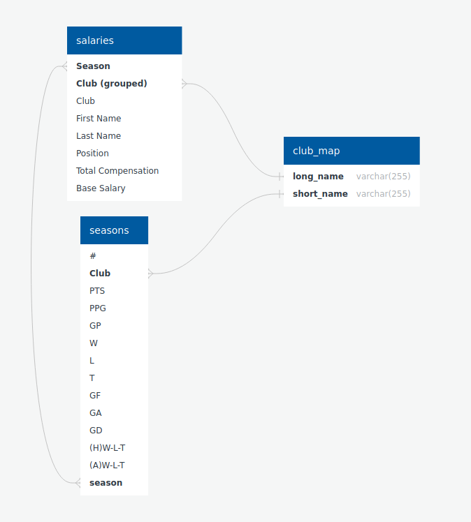

# UMN_PR02_ETL
## Project 2: ETL Challenge

This project was completed by Karim, Mikhail, Josh and Michael.

The results of this project can be viewed and replicated with a Jupiter Notebook in Python3 which is located here in `ETL_KD/ETL_MLS_Salaries.ipynb`

Also please refer to `ETL_KD/MLSstandingsKD.ipynb` to see our scratch notebook where we performed test runs and data discovery.

## EXTRACT

### 1. Data World

An extensive research on MLS players' salaries lead us to discovery of a data sheet of detailed salary information on the Data.world website. The data is open to download in csv format.

### 2. MLS Soccer

The games stats per season can be found at MLSsoccer.com website, categorized by seasons. We pulled the data by iterating through seasons using Pandas.

## TRANSFORM

Since we have data from different sources to join the two datasets a mapping dictionary was discovered to be needed. The Salaries table refers to the soccer clubs by their abbreviations while the Seasons table uses full names of the clubs. Because there is only a couple of dozen clubs in MLS league the mapping table could easily be composed manually. All was needed is a Select query on unique names and unique abbreviations from the two tables and match them together. See the "create table club_map" part in the notebook.

## LOAD

For storing data together for future analysis a sqlite database was chosen as the most versatile database engine.

The database schema was defined [quickdatabasediagrams.com](https://app.quickdatabasediagrams.com) as follows:

## API

Run API/app.py to gain programmatical access to the data

---
If you read this put word Zeus in the homework comment.

